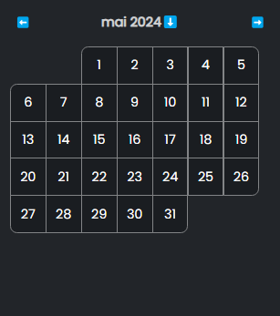

# Day Reference

[[toc]]

## DayProps

### `children`

**Type**: `(props: DayInnerProps) => ReactNode `

The callback that will be called to render each day in the calendar.

## DayInnerProps

::: info
The props below are completely "optional", meaning you are free not to use them and to manipulate the api manually if needed (e.g. we provide a default `alt` prop but if you want to use another date format for example, you can just ignore it :+1:)
:::

### `onClick`

**Type**: `() => void`

The default click handler for the day. Will update the date as well as doing some basic checks related to other features of the calendar like min/max range, etc...

### `isToday`

**Type**: `boolean`

Is the day being rendered the actual today's date

### `isSelected`

**Type**: `boolean`

Is the day being rendered the one that is already selected (after a user clicked it for example)

### `belongsToSelectedMonth`

**Type**: `boolean`

Is the day being rendered in the month of today's date.

### `isOutOfRange`

**Type**: `boolean`

Is the day being rendered outside of the min/max range provided.

### `isOverlapPlaceholder`

**Type**: `boolean`

Is the day being rendered a "fake" day, useful to create the spacing needed if you don't want to render days outside of the current month with the `no-overlap-with-offset` offset mode

### `date`

**Type**: `Dayjs`

The Dayjs date object, which you can use to extract the text to render in the cell

### `alt`

**Type**: `string`
**Example**: `dimanche 31 mars 2024`

The default `alt` value to render on the button. The format lang is automatically adapted to your defined dayjs locale.

### `corners`

**Type**: `{topLeft: boolean, topRight: boolean, bottomLeft: boolean, bottomRight: boolean}`

The object defining whether or not you should round a corner of the rendered day. This is pretty useful and easy to use when your design needs this.

The reason why you would want this instead of corning the first and last items of the first and last row is because with certain rendering mode, some items in the 2nd or before-to-last row might need to be corned too

